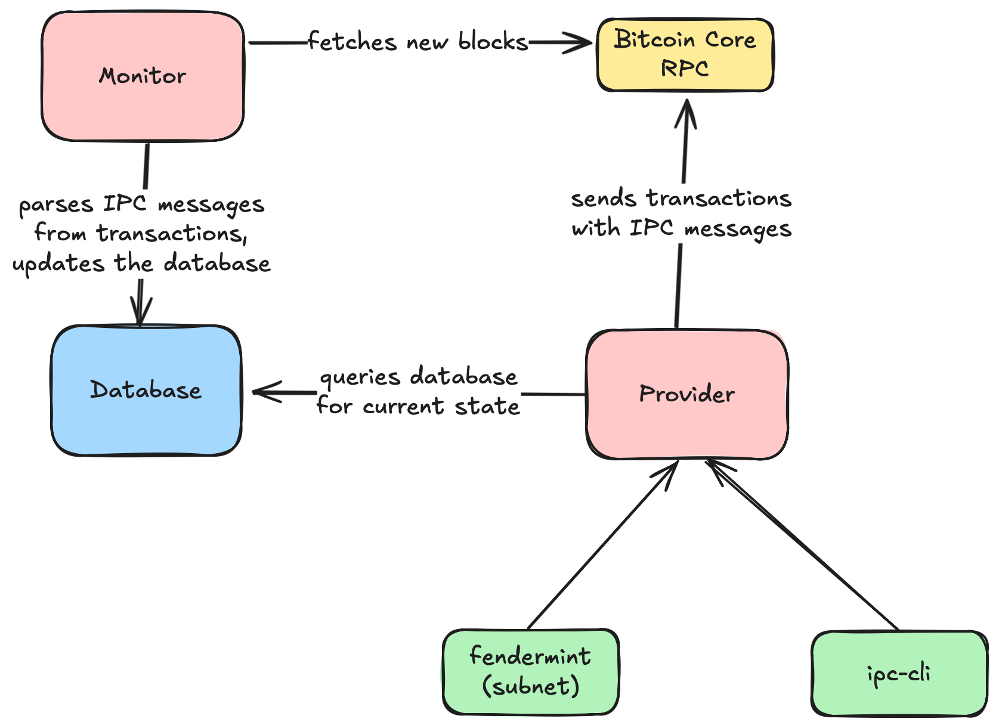

# Bitcoin IPC (InterPlanetary Consensus)

## Overview

See [docs](https://bitcoin-scaling-labs-docs.gitbook.io).

## Components

### Provider

Exposes an HTTP endpoint with a JSON RPC to interact with Bitcoin. It's primarily intented to be used by the IPC Subnet Manager. It listens on the port configurable by `PROVIDER_PORT`, defaulting to 3030. It requires an Authorization header with a bearer token to be set to the value of `PROVIDER_AUTH_TOKEN`.

It signs all Bitcoin multisig transactions using the private key set in the `VALIDATOR_SK_PATH` environment variable, which defines the path to the private key file.

### Monitor

Monitors the Bitcoin network for new blocks and transactions. It processes transactions with IPC-related data. It saves the data in a local database, configurable by `DATABASE_URL` environment variable.

Deleting the database and rerunning monitor should not cause any issues, as only side-effects it has is importing new address as watch-only in Bitcoin Core. It should rebuild the database from the Bitcoin blockchain.

## Configuration

See `.env.example` for the list of environment variables. Example `.env` files can be found in `internal/demo.ipc`.

## Usage and auditing
**‼️ All modules in the Bitcoin-IPC stack have not been audited or otherwise verified. We strongly advise against deploying IPC on mainnet and/or using it with tokens with real value.**
