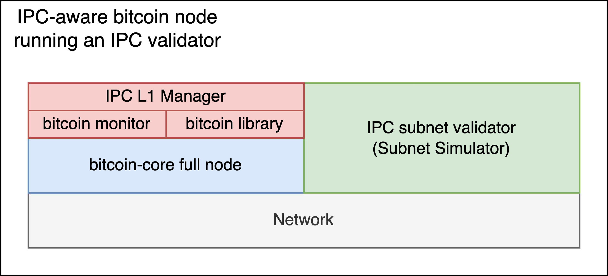
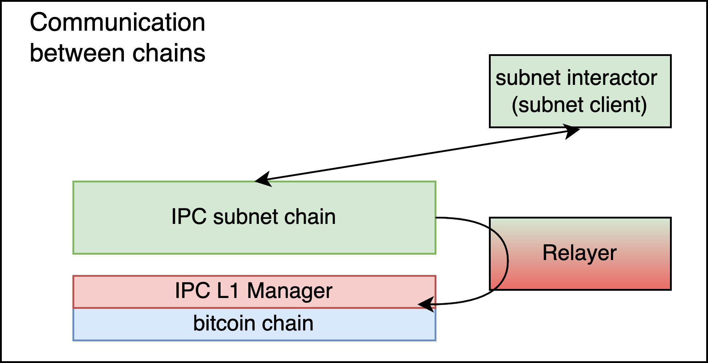

# Software stack on an IPC-aware node
**Definition:**
An *IPC-aware node* (or simply *IPC-node*) is a bitcoin full node with IPC integration, i.e., that supports viewing, creating, and joining existing IPC subnets on Bitcoin.

An IPC-aware node runs all the following modules.

## Bitcoin full node
A bitcoin node must be available to connect to over RPC. This can be either a local node running Bitcoin Core or a public bitcoin full node.
All examples and demos in this repo assume the first approach, with a `bitcoin core` connected to a local testnet.

## IPC L1 Manager
It is responsible for keeping track of the `IpcState`.
It also exposes an interface that allows the user to modify it (e.g., create new subnet or join an existing).
It consists of two submodules, the Bitcoin Monitor and the BTC-IPC library.

### Bitcoin Monitor
It monitors the bitcoin chain (using the Bitcoin full node over RPC) for IPC-related transactions.
This could be, for example, a create-subnet command, submitted by another bitcoin user.
Whenever such a transaction is detected and becomes final, the Bitcoin Monitor parses it and communicates the result back to the IPC L1 Manager.

### BTC-IPC library
It contains all the necessary logic for translating IPC commands (such as `createChild`, `joinChild`, submit a checkpoint from a subnet, propagate subnet transactions for one subnet to another) to bitcoin transactions.
It is used by the IPC L1 Manager and the Relayer modules.

## Subnet Validator (Simulator)
An IPC-aware node that decides to join a child runs a validator for that subnet.

As explained in `scope-of-work.md`, in the first stage a `Subnet Simulator` will be used to instantiate the subnet. This is a mock implementation of a validator that runs locally on the IPC-aware node and connects to no other validators (equivalent to a single-validator subnet). It maintains the `SubnetState` and exposes a simple interface, simulating a token-transfer application.

In later Stages Fendermint nodes will be used as the validator.

In this project we demonstrate only one type of application: a token transfer system with uniquely-owned accounts.
Hence, the interface of the Subnet Simulator looks like the following (described on a high level here):
- create_account()
- transfer()
- withdraw()
- get_checkpoint()

As the Subnet Simulator is the only point in the architecture where the `SubnetState` is held, it is responsible to return the state to be checkpointed. This is facilitated by the `get_checkpoint()` method.

Since the node runs a bitcoin full node, it can use that node for bridging events from the bitcoin chain into the subnet.

# Off-chain componnets

## Relayer
This component is responsible for monitoring all IPC subnets and relaying necessary information from IPC subnets to bitcoin.
It could also run on a different machine, by a different entity, or be implemented in a decentralized manner. Here we make it a process run by an IPC node.

It works as follows:
- It periodically checks the `postBox` of each subnet. If there are cross-chain `transfer` or `withdraw` commands, it uses the BTC-IPC library to submit the appropriate transaction to bitcoin.
- It periodically calls `get_checkpoint()` on the subnet and submits the checkpoint to bitcoin, using the BTC-IPC library.

To achieve these, it connects to all the validators of the subnet. In the initial stages, where the subnet is instantiated by a Subnet Simulator, the Relayer only uses the interface of the Subnet Simulator to read the postbox and perform the checkpointing.
In later stages, when the Fendermint node will be used to instantiate a subnet, the Relayer will connect to it using the means provided by Fendermint.

## Subnet Interactor
The Subnet Interactor is not mandatory on an IPC-aware node.
It allows the users of a subnet to interact with it.

The Subnet Interactor connects to all the validators of the subnet in order to submit subnet-related commands.
Similar to what we describe with the Relayer, in the initial stages where the subnet is instantiated by a `Subnet Simulator` running locally, the Subnet Interactor only uses the interface of the `Subnet Simulator`.
In later stages, when the Fendermint node will be used to instantiate a subnet, the Subnet Interactor will actually connect to all subnet validators.

The role of the Subnet Interactor and the Relayer can be seen visually in the following diagram.

# State
We define the following types of state.

## IpcState
It is the state related to IPC framework on the L1 (bitcoin). 
It is a collection of entries, one for each L2 subnet, containing (non-exhaustive)

- the subnet ID
- URL (e.g., BTC/A, BTC/B)
- entry requirements (required collateral)
- number of required validators
- number of validators joined
- for each validator joined, a struct with the validator data:
    - name
    - IP

The `IpcState` is maintained on each IPC-aware node in the `IPC L1 Manager` module (see architecture.md for a definition of these terms).
It is derived from the createChild() and joinChild() transactions that the `Bitcoin Monitor` observes on the bitcoin network.

Note that `IpcState` does **not** contain internal subnet state (see `SubnetState` for this).
It does **not** contain information about L3+ subnets either.  

## SubnetState
It contains the application state of a subnet. It is subnet specific.
In this demo, we assume a simple token transfer application with uniquely-owned accounts, hence the `SubnetState` contains:

- accounts
- balances

The `SubnetState` is maintained only by IPC Validators. In the first stage, where a `Subnet Simulator` is used intead of a real IPC Validator, the `SubnetState` is maintained exclusively in the `Subnet Simulator`.

We remark that, in Stage 1, `SubnetState` contains **only** subnet-specific state. In consequent stages it may have to contain a part of `IpcState`, so that, for example, validators can connect to each other, or in case the child subnet must be aware of its parent subnet.