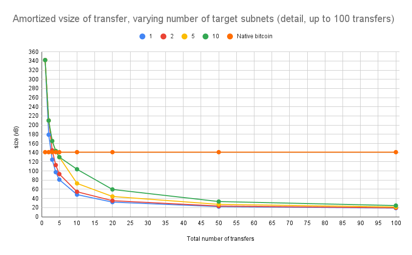
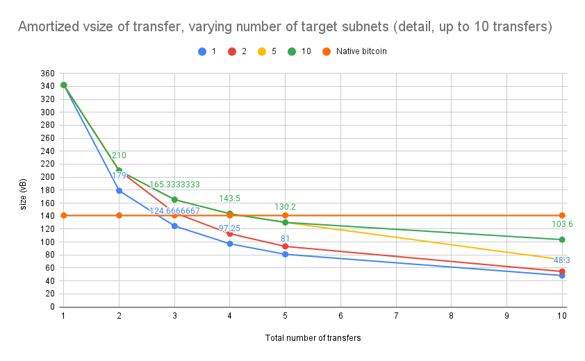
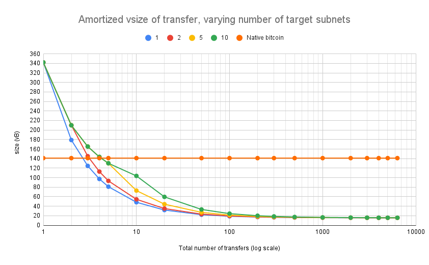
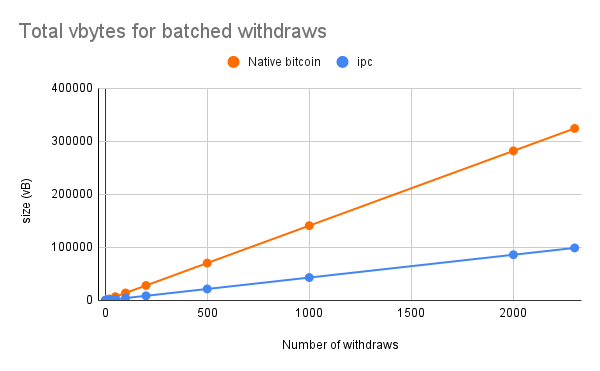
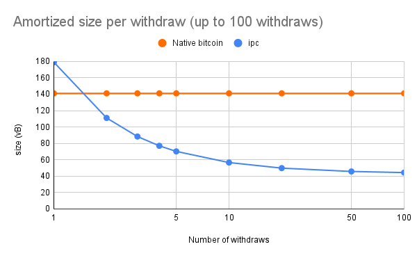

# Benchmarking the size of transfer()

We want to compare the virtual size of data written on bitcoin (in virtual bytes, or vB) for transferring some amount between
1. two bitcoin users
2. two IPC users with accounts on IPC L2 subnets.

The first case always consumes 141 vB, which is the bitcoin size of a transaction with one input (a UTXO owned by the sender) and two outputs (a UTXO locked with the recipient's address and a change UTXO). Hence, *N* transfers require *141N* vB.

In the second case, we can batch multiple transfers, which leads to a lower amortized size per transfer. The logic is the following (see `transactions.md` for details): Periodically we read the postbox of an L2 subnet *A* and batch together all transfers that are found there. Obviously, all batched transfers have the same source subnet, but they may have different target subnets, e.g., we may batch two transfers from *A* to *B* and two from *A* to *C*.
The code creates two bitcoin transactions, a *commit* and a *reveal* transaction. The commit transaction contains one input UTXO for the source subnet and one output UTXO per target subnet, as well as one output UTXO locked with the hash of a script. The reveal transaction uses this script-UTXO as input and reveals the full script in the witness. The full script contains the details of each transfer, that is, the recipient account and the amount.

### Running the benchmark
We measure the virtual size of the batched transfers in `benches/measure_transfer_weight.rs`, for multiple numbers of target subnet (variable `number_of_subnets`). The benchmark batches a number of transfers (variable `total_transfers`), equally split among all target subnets, and then creates the required bitcoin transactions using the functionality in `src/ipc-lib.rs`.

To run the benchmark, start a local `bitcoin core` node and `btc_monitor` (following the Setup steps and steps 1 and 2 from `README.md`).
Then you can use
```
cargo run --bin measure_transfer_weight
```

The code first creates the required number of subnets, if they are not already created, and then runs the benchmark.

### Results
The code writes the result in `outputs/transfer.csv`. We then manually paste the content in a [Spreadsheet file](https://docs.google.com/spreadsheets/d/1VZtpPHY2IwF11sb3uXlqa6nXgET-CbNxcq4vbO-lqiU/edit?usp=sharing) and do the following analysis.

- The benchmark outputs the size (in vB) of the commit and the reveal transactions.
- We add the size of both transactions.
- We divide with the total number of transfers in the batch, which gives us the *amortized size* of each transfer.
- We plot the amortized size per transfer vs total number of transfers.

In the following diagram we see the result for up to 100 total transfers.  


In the plot we see the following:
- Using native bitcoin transfers, the size per transfers remains, of course, constant, at 141 vB.
- The plot shows one line per number of target IPC subnets (for 1, 2, 5, 10 subnets).
- Using the IPC infrastructure, independently of the number of target subnets, the amortized cost per transfer drops.
- The more the target subnets, the more expensive the batched transfer is. This is because
    1. The commit transaction contains one output UTXO per target subnet.
    2. The reveal transaction contains (only once) the address of each target subnet.

### Finding the breakeven point
In the following diagram we zoom-in in the area 1-10 transfers.
The plot also shows the data values for the 1-target-subnet and 10-target-subnet lines.  


Remark: If the number of transfers for a data point is smaller than the number of target subnets, the benchmark does not use all target subnets.
E.g., if we are on the line with 10 subnets, the data point at 2 transfers sends 2 transfers at two different target subnets, the data point at 5 uses five target subnets, and so on. For this reason, some points on the lines coincide, e.g.: 
- 1-target-subnet with 1 transfer = 2-target-subnet with 1 transfer
- 2-target-subnet with 2 transfers = 5-target-subnet with 2 transfers

We observe that the usage of IPC subnets starts paying off if we batch at least 3 to 5 transfers, depending on the number of target subnets. For example:
    - If all transfers have the same target subnet, then IPC can batch 3 transfers using ~124.7 vB on average for each, which is cheaper than the 141 vB of native bitcoin.
    - If the transfers have two different target subnets, then IPC needs a bit more space to encode them, ~145 vB per transfer for 3 transfers, and ~113 vB per transfer for 4 transfers, hence IPC saves space if we batch at least 4 transfers.
    - If the transfers have five target subnets, IPC pays off we batch at least 5 transactions.
    - If the transfers have any >5 target subnets, IPC always pays off we batch at least 5 of them (e.g., allowing up to ten target subnets pays off for 5 or more transactions).

### Taking batching to the limits
The limit for batching transfers is the limit of bitcoin on `standard transactions`, which is 100K vB [source: bitcoin implementation](https://github.com/bitcoin/bitcoin/blob/3c098a8aa0780009c11b66b1a5d488a928629ebf/src/policy/policy.h#L24).
To reach this limit, we increase the batched number of transactions, as long as each of the commit and the reveal transactions fit in less than 100K vB (standard, mention), which fits 6350 transfers (we remark that the two transactions can appear in different blocks). 

We get the following result.  


From this plot we can see that
- For any number of target subnets, the amortized virtual size per transfer using IPC converges to 15.8 vB. This is a 9-times compression, compared to standard bitcoin without IPC L2 networks.


### General observations

Observations from the data on the [Spreadsheet file](https://docs.google.com/spreadsheets/d/1VZtpPHY2IwF11sb3uXlqa6nXgET-CbNxcq4vbO-lqiU/edit?usp=sharing) and these plots:
- The size of the commit transaction only depends on the number of target subnets, as it includes one output UTXO per target subnet. It adds +43 vB for each target subnet.
- The reveal transaction grows with every transfer we add and with every subnet.
- The reveal transaction grows faster than the commit transaction, and it is the first to reach the 100K vB limit.

### Conclusion
Essentially, IPC offers a throughput-latency trade-off: An IPC subnet, either periodically or when a certain number of outgoing transfers become finalized in it, creates a batch and submits it to bitcoin. The bigger the batch is, the cheaper it will be, in terms of bytes written to bitcoin, but also the more time it takes to fill the batch.

For large enough batches, our experiments show that we can reach a *compression factor* of 9.

# Benchmarking the size of withdraw()

We want to compare the virtual size of data written on bitcoin (in virtual bytes, or vB) for withdrawing some amount from a BTC account when:
1.  A single BTC transaction per withdraw
2. The account we withdraw from is an IPC subnet and is batching multiple withdraws


As mentioned earlier, the first case always consumes 141 vB, which is the bitcoin size of a transaction with one input (a UTXO owned by the sender) and two outputs (a UTXO locked with the recipient's address and a change UTXO).
Hence, *N* withdraws require *141N* vB.

In the second case, we can batch multiple withdraws, which leads to a lower amortized size per withdraw. The logic is the following (see `transactions.md` for details): 
Periodically we read the postbox of an L2 subnet *A* and batch together all withdraws that are found there. Obviously, all batched withdraws have the same source subnet, 
but they have a different destination address (the user BTC address). The code creates a BTC transaction with 1 input, and *N+2* outputs. 
There is one output for each of the *N* withdraws, one change output and one *OP_RETURN* output indicating that it is an IPC withdraw command. 

### Running the benchmark
We measure the virtual size of the batched withdraws in `benches/measure_withdraw_weight.rs`. The benchmark creates a withdraw transaction using the functionality in `src/ipc-lib.rs`
where the withdraws are generated randomly and the number of withdraws is indicated by the variable `number_of_withdraws`.

To run the benchmark, start a local `bitcoin core` node (following the Setup steps and step 1 fro `README.md`).
Then you can use
```
cargo run --bin measure_withdraw_weight
```

The code assumes that there exists at least one subnet.

### Results
The code writes the result in `outputs/withdraw.csv`. We then manually paste the content in a [Spreadsheet file](https://docs.google.com/spreadsheets/d/1VZtpPHY2IwF11sb3uXlqa6nXgET-CbNxcq4vbO-lqiU/edit?usp=sharing) 
and do the following analysis.

- The benchmark outputs the size (in vB) of the withdraw transaction for a particular number of withdraws.
- We divide with the total number of withdraws in the batch, which gives us the *amortized size* of each withdraw.
- We plot the amortized size of each withdraw depending on the number of withdraws vs the size of a withdraw treated like a BTC transfer.
- We plot the total size of batched withdraws depending on the number of withdraws vs the total size of withdraws if each withdraw is represented by a BTC transfer.

This plot displays the how total vB required to batch all withdraws into one transaction changes as the number of withdraws grows, compared to 141 * *N* representing standard BTC transfers.  


Whereas this plot also shows how the *amortized size* per withdraw changes as the number of withdraws grows compared to the 141 vB required for a BTC transfer.                               



### Taking batching to the limits
Similarly to the transfer batching, withdraw batching is also limited by the `standard transactions` size on bitcoin. To reach this limit, we increase the number of withdraws as long as the withdraw transaction fits in less than 100K vB, which fits roughly 2300 withdraws. 


From the first plot and the compression factor column we can see that even for *N=50* we reach 3-times compression, compared to standard bitcoin transfers.


