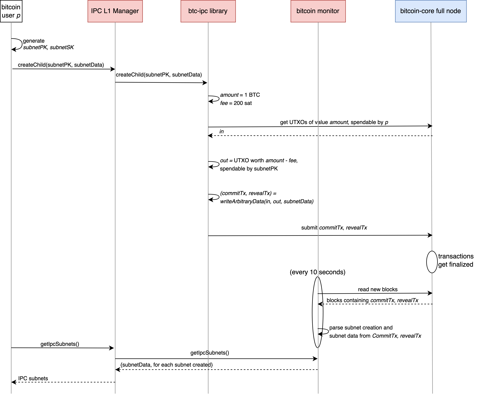
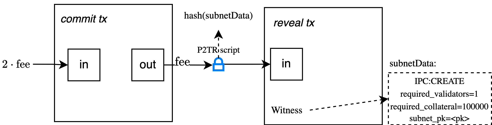
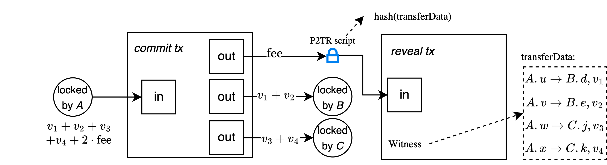

## Preliminaries
- We identify L2 subnets using their `subnetAddress`, see `addressing.md`.

## Attach arbitrary data to bitcoin transactions
This will be done using the script-spend path of a taproot transaction.

We model this as a functionality **writeArbitraryData(in, out, data**), where *in* and *out* are the input and output UTXOS, respectively, and *data* some arbitrary data. The functionality is implemented by **two** bitcoin transactions. Specifically:
- Create a script containing *data*.
- Create **commitTx**, the first Bitcoin transaction, that spends the UTXO(s) *in* and creates the output UTXOs *out* and an UTXO *temp*, which contains the hash of the script.
- Create **revealTx**, the second bitcoin transaction, that spends *temp* by revealing the content of the script as the *witness*.
- Observe that *data* is submitted with a lower transaction fee as witness.
- These two bitcoin transactions are submitted to Bitcoin by the same entity.

We will be using the **writeArbitraryData()** functionality to implement IPC commands such as *createChild*, *joinChild*, and *transfer*.

## Script construction & parsing
Bitcoin has a limit of 520 bytes for a single stack push operation. In order not to be limited by this constraint, we split the 
data that we want to commit to into 520 byte chunks and perform an OP_PUSH for each chunk.
For a script to be valid, bitcoin expects the script to finish execution with only 1 element on the stack which is why we add
an OP_DROP opcode after each OP_PUSH.
To make sure that the script has exactly 1 item after its execution, we add an OP_TRUE in the end.

The btc_monitor is responsible to read and reconstruct the data encoded in the script. By looking only at the OP_PUSH opcodes and 
appending (in an array) the byte data that comes afterwards, the btc_monitor reconstructs
the arbitrary data that was encoded within the script. Additionally, since OP_DROP and OP_TRUE are opcodes which are expected to be
seen but do not carry any data, the btc_monitor ignores them.

To prevent attacks, the btc_monitor doesn't parse any script that contains any opcode other than OP_PUSH, OP_DROP and OP_TRUE.

## Fee calculation model
The current fee calculation model uses the *estimatesmartfee* rpc call.

This function returns the *feeRate* per vKB. As parameters to the function, we pass 6 which is when we expect confirmation of the
transactions and ECONOMICAL which determines how conservative should the protocol be for fee estimation.

We estimate the fee calculation by taking into account the following parameters:
- Number of inputs (75 vbytes each)
- Number of outputs (34 vbytes each)
- Number of witness bytes

For the fee calculation:
For each transaction, we take an average of 2 inputs, therefore starting with 150 vbytes.
Depending on what the transaction represents, the number of outputs varies. For instance, for withdraw, we have 1 output per withdraw perfromed.
The witness bytes are multiplied by 0.25 since they only "weigh" a quarter of the total bytes.

By summing each of these values we get an estimation of the amount of vbytes of the transaction.

After having the vbytes of the transaction, we multiply this number by *feeRate* and divide it by 1000 because we want the fee per vbyte.

## Create child subnet
This command allows IPC-aware nodes (see `architecture.md`) to become validators in an IPC L2 subnet.

We model this as a functionality *createChild(subnetData)*:

- *subnetData* contains the following data:
    - A known tag that this transaction is about creating a new IPC Subnet.
    - The designated number of subnet validators and the required collateral for each.
    - Possibly more arbitrary data.
- The functionality will be implemented using the *writeArbitraryData(in, out, data)* functionality, where:
    - *in*: UTXO(s) spendable by the wallet that submits *createChild()*
    - *out*: a UTXO with some amount locked by *subnetPK*, which will be used to pay the transactions fees in later stages.
    - *data*: *subnetData*

Here is the flow of a subnet creation.

Specifically, the user that wants to create an IPC subnet does the following:
- create a bitcoin key pair, let `subnetPK` and `subnetSK` be the public and secret key, respectively
- store locally the  `subnetSK`
- use `subnetPK` when calling `createChild()`

Observe in the diagram that *subnetPK* is computed locally at the machine of the process that submits the *createChild()* command. The *subnetSK* will be used when a signature from the subnet is required.
In Stage 3 this will be replaced by an interactive protocol. See `subnet-pk.md` for more explanation.

The btc_monitor is responsible for detecting a *createChild* transaction. The btc_monitor pools the chain 
for newly produced blocks and checks if a transaction contains an IPC create command in the witness.
If the IPC create command keyword is detected in the witness, the btc_monitor extracts the other parameters
encoded in the commit-reveal transaction and creates a new subnet entity.

**Example:**

Let's visualize how the commit-reveal technique works through an example.
Assume we want to create a subnet with 1 validator (as is the case in Stage 1), whose required collateral is 1 BTC.

The code that implements *createChild* constructs the following *subnetData* string:
`IPC:CREATE#required_number_of_validators=1#required_collateral=100000000#subnet_pk=bc1pqqqqqqqqqqqqqqqqqqqqqqqqqqqqqqqqqqqqqqqqqqqqqqqqqqqqpqqenm`. The bytes of this string are put into a P2TR script. 

First the commit transaction is constructed:
- The input is a UTXO of value at least 2*fee* (this will be used for the fees of the two transactions), spendable by the user that creates the subnet.
- The output is a UTXO locked with P2TR script. i.e., the script serves as a scriptPubKey. The value of this UTXO must be at least *fee*.

Observe that, at this point, only the hash of the script is visible on the bitcoin network. The commit transaction is signed (using the wallet of the user that creates the subnet) and submitted to bitcoin.

Then, the reveal transaction is constructed, with one input and one output UTXO:
- The input is the UTXO that we previously locked with the script.
- The output is a change UTXO that returns the whole value of the input minus *fee* to the user (hence, *fee* is the fee for the reveal transaction).

For the reveal transaction to be valid, it must contain a *witness* that unlocks the input UTXO. The witness contains the full *subnetData* string.

The following diagram shows how this example pictorially:

Remark: In the diagram we simplify the fee logic, assuming that each transaction pays the same fee.

## Join subnet
We model this as a functionality *joinChild(subnetAddress, validatorData)*:
- *validatorData* contains validator’s info, such as their IP, to allow discovery from other validators of the subnet
- It is implemented using the *writeArbitraryData(in, out, data)* functionality, where:
    - *in*: UTXO(s) spendable by the node that wants to become a validator
    - *out*: a UTXO with collateral BTC locked by *subnetPK*
    - *data*: *validatorData* + *subnetData*

Similarly to createChild, after a joinChild transaction is detected, the btc_monitor extracts the parameters 
encoded in the commit-reveal transaction which contain the validator and subnet data and updates the state of 
the particular subnet. joinChild behaves exactly the same in a single and multi-validator setting. The only difference
is the number of validators that call execute the joinChild command.

## Checkpoint
We model this as a functionality *checkpoint(checkpointHash)*
It is implemented as a single bitcoin transaction with the following inputs and outputs:
- *in*: UTXO(s) spendable by the *subnetPK* that is submitting the checkpoint
- *output*: a UTXO with 0 value, containing the OP_RETURN opcode *ipcCheckpointKeyword* *checkpointHash*

The relayer is responsible for periodically (every `checkpoint_interval`) submitting checkpoints on behalf of the subnet. The Relayer obtains a 
commitment (implemented as a hash) of the state from the subnet (specifically for Stage 1 from the simulator), it 
creates a bitcoin transaction that includes the IPC checkpoint command keyword *ipcCheckpointKeyword* and the commitment *checkpointHash*, and asks the 
validators to sign it. Upon constructing a valid signature, the relayer submits the transaction to the network.
The fees for this transaction are taken from UTXO *in*, that is, the subnet pays for the checkpoint fees.

It is the responsibility of the btc_monitor to also detect checkpoint transactions. Upon examining the OP_RETURN outputs 
and detecting the IPC checkpoint keyword, the btc_monitor looks for the subnet whose *subnetPK* verifies
the signature produced on the transaction inputs. After successful signature verification, the btc_monitor is aware
of the checkpoints made for a particular subnet.

## Deposit
This command allows subnet users to deposit funds from their bitcoin wallet to their subnet address (denoted *userAddress*). 
Specifically, they can "lock" an amount of BTC on L1 and "mine" an equal amount of *wrapped BTC* on the L2 subnet.

We model this as a functionality *deposit(subnetAddress, amount, userAddress)*.
It is implemented as a single bitcoin transaction with the following inputs and outputs:
- *in*: UTXO(s), spendable by the user's wallet, with total value the desired *amount* plus the miner's fee.
- *output*: (1) A UTXO of value *V*, locked with the *subnetPK* that corresponds to *subnetAddress*. (2) A UTXO with 0 value, containing "<OP_RETURN opcode> <*ipcDepositKeyword*> <*userAddress*>".
The function is signed and submitted by the user. 

We assume that, prior to using the deposit functionality, the user connects to the subnet
and creates a key pair, from which and obtains the *userAddress* for the subnet.

The deposit transaction contains *ipcDepositKeyword*, an IPC keyword, so as to be able to be detected by the btc_monitor. 
The BTC monitor checks if a subnet exists such that the script pubkey of the deposit transaction corresponds to 
a script pubkey generated using a *subnetAddress*. This is the way that btc_monitor fully identifies a
deposit trnasaction. After fetching all the required parameters, the btc_monitor calls the subnet simulator deposit function.
Since every validator operates both a btc_monitor and a subnet simulator, no modifications to the deposit transaction are needed, 
regardless of whether the system operates in a single or multi-validator setting.

## Transfer 
This command allows users of a subnet (e.g. subnet_A) to transfer funds to one or more different subnets (e.g. subnet_B and subnet_C).
We model this as a functionality *transfer(transferData)*, where:
- *transferData* contains a batch of transfers. Each entry batch contains (1) the target *subnetAddress*, (2) the *destinationAddress* where the amount should be transferred, and (3) the *amount*.

It is implemented using the *writeArbitraryData(in, out, data)* functionality, where:
- *in*: UTXO(s), spendable by the subnetPK of subnet_A
- *out*: UTXO(s), one for each target subnet *subnetAddress*, with a value equal to the sum of all transfers to that *subnetAddress*, locked by the subnetPK of *subnetAddress*.
- *data*: contains the *transferData*

Example:
- Accounts on subnet A: *u,v,w,x*.
- Accounts on B: *d,e*.
- Accounts on C: *j,k*.
- We want to batch: 
    - A.u->B.d, amount v1
    - A.v->B.e, amount v2
    - A.w->C.j, amount v3
    - A.x->C.k., amount v4

The following diagram shows how the transaction is implemented:

Remark: In the diagram we simplify the fee logic, assuming that each transaction pays the same fee.

Since we use the *writeArbitraryData* functionality, we send both a commit and a reveal transaction to the network.
The commit transaction, apart from the encoded data, it also locks UTXOs with the subnetPK of subnets B and C.

The data contains an IPC keyword *ipcTransferKeyword* to allow the btc_monitor to detect this transaction.
The BTC monitor then extracts the data which is encoded in the commit-reveal transaction and validates whether the UTXO(s) 
locked by the target subnetPK correspond to the values specified by the transfers in transferData. After successful
confirmation, the target addresses specified in the transfers get funded through the subnet simulator.

## Withdraw
This command allows users of a subnet (e.g. subnet_A) to withdraw funds from the subnet to a certain bitcoin address.

It is implemented as a single bitcoin transaction with the following inputs and outputs:
- *in*: UTXO(s), spendable by the subnetPK of subnet_A
- *out*: UTXO(s), each having a value corresponding to the value of a particular withdraw, locked by the public key of the user.
Additionally, it has an OP_RETURN output that contains the *ipcWithdrawKeyword*

Remark: It is important to note that we can further optimize the functionality by merging both withdrawals and transfers to be handled within
a single commit-reveal tx, where the withdraws+opreturn would be encoded on the commit-tx. But for demo purposes, to clearly separate the functionality, we separate these two functionalities.

The OP_RETURN contains an IPC keyword *ipcWithdrawKeyword* to allow the btc_monitor to detect this transaction.
The BTC monitor then proceeds to print a message for the amounts that were withdrawn.

## Delete 
This command allows to delete a subnet (e.g. subnet_A).

It is implemented as a single bitcoin transaction with the following inputs and outputs:
- *in*: UTXO(s), spendable by the subnetPK of subnet_A
- *out*: UTXO(s), each having a value corresponding to the *requiredCollateral* value defined by the subnet, locked by the address that each validator provided when joining.
Additionally, it has an OP_RETURN output that contains the *ipcDeleteKeyword*

The OP_RETURN contains an IPC keyword *ipcWithdrawKeyword* to allow the btc_monitor to detect this transaction.
The BTC monitor then proceeds to print a message that a particular subnet has been deleted and to delete the stored subnet state.

